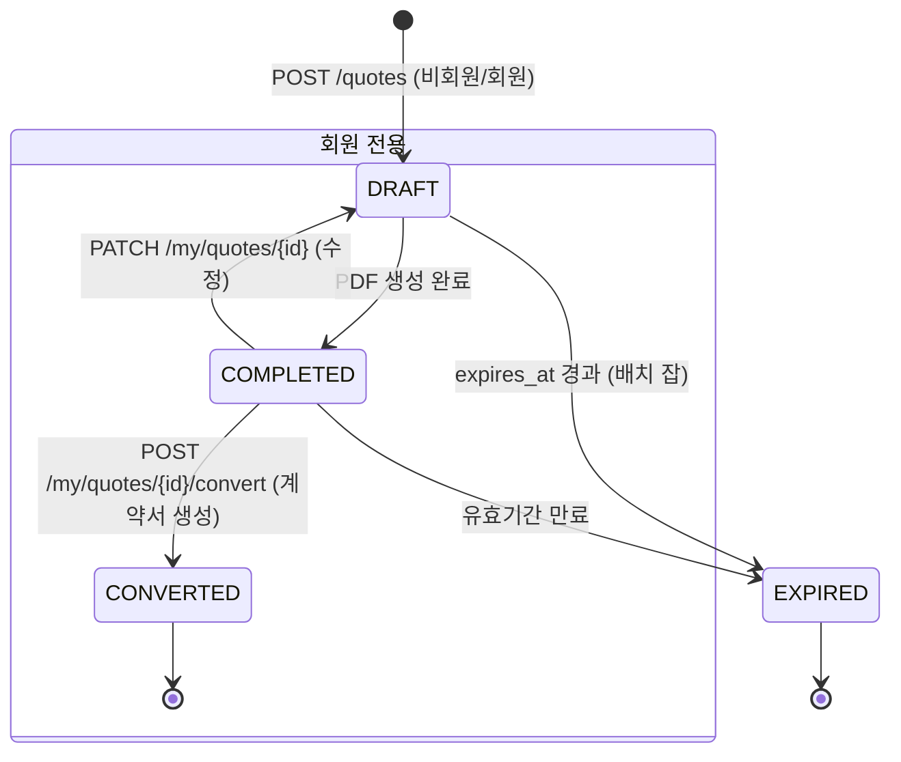

# 견적 프로그램 기술 명세서 (Quotation System Spec v2.0)

> **목적**: 비회원 1회 무료 견적 생성(바이럴) → 회원가입/유료 전환(락인) → ERP 확장 기반이 되는 **MVP(Phase 1) 백엔드/프론트엔드 공통 계약서**  
> **범위**: FastAPI(Modular Monolith) + PostgreSQL + React(Next.js) + PDF(WeasyPrint/ReportLab) + Object Storage(S3/R2)

---

## 1. 도메인 모델 및 DB 스키마 (PostgreSQL ERD)

### 1.1 핵심 엔티티 (Phase 1: 비회원/회원 공통)

```mermaid
erDiagram
    QUOTE ||--o{ QUOTE_ITEM : contains
    QUOTE ||--o{ QUOTE_DESIGN : "has design snapshot"
    USER ||--o{ QUOTE : owns
    TEMPLATE ||--o{ QUOTE_ITEM : "preset for"
    COMPANY_INFO ||--|| USER : owns

    QUOTE {
        uuid id PK "Public ID (URL용)"
        string quote_number UK "견적번호 (회원전용: YYMM-SEQ, 비회원: TEMP-UUID)"
        uuid user_id FK "NULLABLE (비회원시 NULL)"
        enum status "DRAFT, COMPLETED, CONVERTED, EXPIRED"
        jsonb customer_info "비정형 고객/현장 정보 (JSONB)"
        jsonb supplier_info "공급자(내 회사) 정보 스냅샷 (JSONB)"
        jsonb calculation_snapshot "산출 로직 입력값 스냅샷 (재계산/수정용)"
        jsonb totals "소계, 할인, 부가세, 총계"
        string watermark_text "워터마크 텍스트 (비회원: 'Powered by 율소프트')"
        string design_key "선택된 디자인 템플릿 키 (classic, modern, color)"
        datetime expires_at "유효기간 (생성일 + 30일 기본)"
        datetime created_at
        datetime updated_at
    }

    QUOTE_ITEM {
        uuid id PK
        uuid quote_id FK
        int sort_order "정렬 순서"
        string area "청소구역 (예: 거실, 화장실)"
        string task "청소내용 (예: 바닥 청소, 유리 닦기)"
        jsonb days "요일 비트마스크/배열 [Mon, Wed, Fri]"
        int qty "수량/횟수"
        int unit_price "단가 (원)"
        int total_price "금액 (qty * unit_price)"
        string exclude_area "제외구역"
        string memo "비고"
    }

    USER {
        uuid id PK
        string email UK
        string password_hash
        string company_name
        string ceo_name
        string biz_reg_no UK "사업자등록번호 (하이픈 제외)"
        jsonb company_address "주소 객체화"
        string phone
        string plan "FREE, PRO, ENTERPRISE"
        int quote_seq "견적번호 자동증가 시퀀스 (회원별)"
        datetime created_at
    }

    TEMPLATE { "자주 쓰는 항목 템플릿 (유료 기능)"
        uuid id PK
        uuid user_id FK
        string name "예: 표준 주 2회 오피스 청소"
        jsonb items "QUOTE_ITEM 배열 템플릿"
    }
```

### 1.2 JSONB 스키마 정의 (코드 레벨 검증용 Pydantic 모델)

```python
# app/schemas/quote.py
from pydantic import BaseModel, Field, EmailStr
from typing import List, Optional, Literal
from datetime import date
from enum import Enum

class DayOfWeek(str, Enum):
    MON = "MON"; TUE = "TUE"; WED = "WED"; THU = "THU"
    FRI = "FRI"; SAT = "SAT"; SUN = "SUN"

class PresetFrequency(str, Enum):
    WEEKLY_1 = "WEEKLY_1"  # 주 1회
    WEEKLY_2 = "WEEKLY_2"  # 주 2회
    WEEKLY_3 = "WEEKLY_3"  # 주 3회
    WEEKLY_5 = "WEEKLY_5"  # 주 5회 (월~금)
    DAILY = "DAILY"        # 매일

PRESET_MAP = {
    PresetFrequency.WEEKLY_1: [DayOfWeek.MON],
    PresetFrequency.WEEKLY_2: [DayOfWeek.MON, DayOfWeek.THU],
    PresetFrequency.WEEKLY_3: [DayOfWeek.MON, DayOfWeek.WED, DayOfWeek.FRI],
    PresetFrequency.WEEKLY_5: [DayOfWeek.MON, DayOfWeek.TUE, DayOfWeek.WED, DayOfWeek.THU, DayOfWeek.FRI],
    PresetFrequency.DAILY: list(DayOfWeek),
}

class CustomerInfo(BaseModel):
    name: str
    phone: str = Field(pattern=r"^01[0-9]-?\d{4}-?\d{4}$")
    email: Optional[EmailStr] = None
    address: str
    detail_address: Optional[str] = None
    building_type: Literal["APT", "OFFICETEL", "OFFICE", "STORE", "FACTORY", "ETC"]
    area_pyeong: Optional[float] = None # 평수 (면적 단가 계산용 옵션)

class SupplierInfo(BaseModel):
    biz_reg_no: str = Field(pattern=r"^\d{10}$")
    company_name: str
    ceo_name: str
    address: str
    business_type: str
    business_item: str
    phone: str
    email: EmailStr

class QuoteItemInput(BaseModel):
    area: str
    task: str
    days: List[DayOfWeek] = Field(min_items=1) # 체크박스 값
    qty: int = Field(ge=1, default=1)
    unit_price: int = Field(ge=0)
    exclude_area: Optional[str] = None
    memo: Optional[str] = None

class CalculationInput(BaseModel):
    items: List[QuoteItemInput]
    discount_type: Literal["NONE", "PERCENT", "AMOUNT"] = "NONE"
    discount_value: int = Field(ge=0, default=0)
    vat_included: bool = False # 단가 VAT 포함 여부
    vat_rate: float = 0.1

class QuoteCreateRequest(BaseModel):
    customer: CustomerInfo
    supplier: Optional[SupplierInfo] = None # 비회원은 입력받음, 회원은 DB에서 조회
    calculation: CalculationInput
    design_key: Literal["classic", "modern", "color"] = "classic"
    expires_days: int = Field(default=30, ge=1, le=365)
    preset_frequency: Optional[PresetFrequency] = None # UI 프리셋 버튼용 (서버에서 days로 변환)

class Totals(BaseModel):
    subtotal: int
    discount_amount: int
    taxable_amount: int
    vat_amount: int
    grand_total: int
```

---

## 2. 산출 로직 명세 (Calculation Engine)

**핵심 원칙**: `QuoteCreateRequest.calculation` 입력값을 받아 **결정론적(Deterministic)**으로 `Totals`와 `QuoteItem.total_price`를 계산. 부동소수점 오차 방지를 위해 **원(원) 단위 정수 연산**만 수행.

```python
# app/services/calculation.py
from decimal import Decimal, ROUND_HALF_UP
from app.schemas.quote import CalculationInput, Totals, QuoteItemInput

def calculate_quote(data: CalculationInput) -> tuple[list[QuoteItemInput], Totals]:
    items = data.items
    subtotal = 0
    
    # 1. 품목별 금액 계산
    for item in items:
        item.total_price = item.qty * item.unit_price
        subtotal += item.total_price

    # 2. 할인 계산
    discount_amount = 0
    if data.discount_type == "PERCENT":
        discount_amount = int(subtotal * data.discount_value / 100)
    elif data.discount_type == "AMOUNT":
        discount_amount = min(data.discount_value, subtotal)
    
    taxable_amount = subtotal - discount_amount

    # 3. 부가세 계산 (반올림: 반올림(0.5 올림))
    # 국세청 기준: 공급가액 * 0.1 -> 원단위 반올림
    vat_amount = int(Decimal(str(taxable_amount)) * Decimal(str(data.vat_rate)).quantize(Decimal('1'), rounding=ROUND_HALF_UP))
    
    grand_total = taxable_amount + vat_amount

    totals = Totals(
        subtotal=subtotal,
        discount_amount=discount_amount,
        taxable_amount=taxable_amount,
        vat_amount=vat_amount,
        grand_total=grand_total
    )
    return items, totals
```

---

## 3. API 계약 (FastAPI Routers)

### 3.1 공개 API (비회원/회원 공통)

| Method | Path | Description | Auth | Rate Limit |
| :--- | :--- | :--- | :--- | :--- |
| `POST` | `/api/v1/quotes/preview` | **견적 산출 미리보기** (DB 저장 안 함, 계산 로직만 검증) | Optional | 30/min |
| `POST` | `/api/v1/quotes` | **견적서 생성 및 저장** (PDF 생성 트리거, Public ID 반환) | Optional | 10/min |
| `GET` | `/api/v1/quotes/{public_id}` | **견적서 조회 (웹 뷰/공유용)** | Public | 60/min |
| `GET` | `/api/v1/quotes/{public_id}/pdf` | **PDF 다운로드** (워터마크 적용 여부 자동 판단) | Public | 20/min |
| `POST` | `/api/v1/quotes/{public_id}/share-link` | **공유 링크 생성/갱신** (Presigned URL 또는 Short Link) | Owner/Public | 10/min |

### 3.2 회원 전용 API (인증 필요: `Authorization: Bearer <JWT>`)

| Method | Path | Description |
| :--- | :--- | :--- |
| `GET` | `/api/v1/my/quotes` | 내 견적서 목록 (페이지네이션, 필터: 상태, 기간) |
| `PATCH` | `/api/v1/my/quotes/{id}` | 견적서 수정 (DRAFT 상태만 가능, 재계산 트리거) |
| `POST` | `/api/v1/my/quotes/{id}/convert` | 계약서로 전환 (상태 `CONVERTED`, 계약서 PDF 생성 트리거) |
| `POST` | `/api/v1/my/templates` | 자주 쓰는 항목 템플릿 저장 (PRO 플랜 이상) |
| `GET` | `/api/v1/my/templates` | 템플릿 목록 조회 |
| `GET` | `/api/v1/my/company-info` | 내 회사 정보 조회/수정 (공급자 정보 자동 채우기용) |

---

## 4. 상태 머신 (Quote Status Flow)



*   **비회원**: `DRAFT` -> `COMPLETED` -> `EXPIRED` (수정/계약 불가, 30일 후 자동 삭제 배치 대상)
*   **회원**: `DRAFT` <-> `COMPLETED` 수정 가능, `CONVERTED` 전환 가능.

---

## 5. PDF 생성 및 디자인 시스템 (핵심 차별화)

### 5.1 아키텍처: **HTML/CSS -> PDF (WeasyPrint)**
*   **이유**: 애플 스타일(웹 폰트, 그림자, 그라데이션, Flex/Grid 레이아웃) 구현 용이, 템플릿 수정 시 배포 불필요(템플릿 DB 저장 또는 파일 교체만으로 가능).
*   **라이브러리**: `WeasyPrint` (Python, CSS Paged Media 표준 지원). `reportlab`(좌표 계산 복잡) 비추천.

### 5.2 디자인 템플릿 3종 (MVP) - CSS Class 전략

```html
<!-- templates/quote/base.html (진입점) -->
<html class="design-{{ quote.design_key }} theme-light">
<head>
    <!-- Google Fonts: Noto Sans KR, Pretendard 로컬 폰트 preload -->
    <link rel="stylesheet" href="{{ url_for('static', path='css/quote-base.css') }}">
    <link rel="stylesheet" href="{{ url_for('static', path='css/design-' ~ quote.design_key ~ '.css') }}">
    <style>/* 워터마크 동적 주입 */ @page { @bottom-center { content: "{{ quote.watermark_text }}"; font-size: 8pt; color: #ccc; } }</style>
</head>
<body>
    <!-- 공통 구조: Header, Table, Summary, Footer(Sign) -->
    
    
    
    
</body>
</html>
```

| Design Key | 컨셉 | 주요 CSS 변수 (`:root`) |
| :--- | :--- | :--- |
| `classic` | **신뢰/관공서/대형빌딩** | `--primary: #1a1a2e; --accent: #c49a6c; --border: 1px solid #ddd; --radius: 0; --font-heading: 'Noto Serif KR';` |
| `modern` | **애플 스타일/스타트업/IT** | `--primary: #1d1d1f; --accent: #0071e3; --border: 1px solid #e5e5e5; --radius: 8px; --font-heading: 'Pretendard', sans-serif; --shadow: 0 4px 20px rgba(0,0,0,0.05);` |
| `color` | **젊은 감각/카페/소형상가** | `--primary: #2e4057; --accent: #e85d75; --bg-alt: #f8f9fa; --radius: 12px;` |

### 5.3 워터마크 전략 (BM 핵심)
*   **비회원/무료**: PDF `@page @bottom-center` CSS로 **"Powered by 율소프트 | www.yulsoft.kr"** 강제 삽입 (제거 불가).
*   **유료 회원**: `watermark_text` = `""` (빈 문자열) -> PDF 생성 시 워터마크 영역 미렌더링.
*   **이미지/PNG 공유용**: `html2canvas` (프론트엔드) 또는 `playwright` (백엔드 헤드리스)로 렌더링 시에도 동일 CSS 적용.

---

## 6. 프론트엔드 UX 명세 (Next.js + Tailwind + Zustand)

### 6.1 입력 폼 플로우 (Stepper UI)

```mermaid
graph LR
    A[Step 1: 고객/현장 정보] --> B[Step 2: 청소 항목 구성]
    B --> C[Step 3: 산출 내역/옵션]
    C --> D[Step 4: 디자인 선택 & 미리보기]
    D --> E[완료: PDF 다운로드 / 링크 복사]